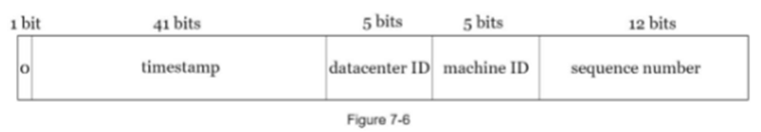

# Tiny URL Service

# TinyURL - Dịch vụ rút gọn URL

## Giới thiệu
TinyURL là một dịch vụ rút gọn URL, cho phép người dùng nhập một đường dẫn dài và nhận về một URL rút gọn. Khi người dùng truy cập vào URL rút gọn, hệ thống sẽ tự động chuyển hướng họ đến URL gốc.

## Luồng hoạt động
- Người dùng nhập một URL dài vào hệ thống.
- Hệ thống xử lý và tạo ra một URL rút gọn (short URL).
- Khi người dùng truy cập short URL, server sẽ trả về mã trạng thái **301 (Moved Permanently)** kèm theo **Location** là URL gốc.
- Trình duyệt sẽ lưu cache phản hồi này và các lần truy cập sau sẽ không cần gửi yêu cầu đến TinyURL server nữa.

## Lưu trữ dữ liệu
- Dữ liệu ánh xạ giữa short URL và long URL được lưu trữ trong cơ sở dữ liệu PostgreSQL.
- Cấu trúc bảng `url_table`:
    - `id`: ID duy nhất
    - `shortURL`: URL rút gọn
    - `longURL`: URL gốc

## Cách chuyển đổi từ long URL -> short URL
Có hai phương pháp chính:

### 1. CRC32
- Áp dụng thuật toán **CRC32** để băm long URL thành một chuỗi hash 7 ký tự.
- Sử dụng **Bloom Filter** để kiểm tra xem short URL đã tồn tại trong database hay chưa:
    - Nếu chưa tồn tại -> lưu vào database.
    - Nếu đã tồn tại -> thực hiện lại bằng cách thêm một chuỗi xác định vào URL gốc trước khi băm lại.

> Tham khảo: [Bloom Filter](https://www.geeksforgeeks.org/bloom-filters-introduction-and-python-implementation/)
### 2. Base62
- Mỗi bản ghi có một ID duy nhất (sử dụng timestamp).
- Chuyển đổi ID thành short URL bằng **Base62 encoding**:
    - Ví dụ: `1115710` -> `[2, 55, 59]` -> `2TX`.
    - Độ dài tối đa là 7 ký tự (đáp ứng quy mô 360 tỷ bản ghi).

## Chuyển hướng (Redirect)
- **301 (Moved Permanently)**: Trình duyệt ghi nhớ short URL và tự động chuyển hướng về long URL mà không cần gọi lại server.
- **302 (Found)**: Trình duyệt sẽ gọi server mỗi lần truy cập short URL, giúp phân tích lưu lượng truy cập.
- Nếu mục tiêu là **giảm tải** cho server -> sử dụng **301**.
- Nếu cần **theo dõi và phân tích traffic** -> sử dụng **302**.

## Hệ thống tạo ID duy nhất
- Sử dụng thuật toán **Snowflake** với cấu trúc:
    - **41 bits**: Timestamp.
    - **5 bits**: Datacenter ID.
    - **5 bits**: Machine ID.
    - **12 bits**: Sequence Number.

>Tham khảo: [Snowflake ID](https://blog.x.com/engineering/en_us/a/2010/announcing-snowflake)



## Tính năng nâng cấp
### 1. Caching (Redis)
- Lưu ánh xạ shortURL:longURL vào **Redis** để tăng tốc độ truy vấn.
- Khi cần lấy longURL:
    - Kiểm tra trong Redis -> nếu có thì trả về.
    - Nếu không có -> truy vấn database -> lưu vào Redis -> trả về longURL.

### 2. ELK Stack (ElasticSearch, Logstash, Kibana)
- Sử dụng **Kafka + ELK** để thu thập, phân tích và trực quan hóa dữ liệu truy cập.

## Cài đặt và chạy dự án
### Yêu cầu hệ thống
- **Java Spring Boot**
- **PostgreSQL**
- **Redis**
- **Kafka + ELK Stack**

### Cách chạy
1. Clone repository:
   ```sh
   git clone https://github.com/Moriarty178/Tiny_URL.git
   cd tinyurl
   ```
2. Cấu hình database trong `application.properties`.
3. Chạy ứng dụng:
   ```sh
   mvn spring-boot:run
   ```
4. Kiểm tra API:
- Rút gọn URL:
  ```sh
  curl -X POST http://localhost:8080/api/v1/tiny-url/shorten -d '{"longURL": "https://example.com"}' -H "Content-Type: application/json"
  ```
- Truy cập short URL:
  ```sh
  curl -L http://localhost:8080/api/v1/tiny-url/{shortURL}
  ```

## 🏗️ Flow Final


## API Reference

#### Generate shorten URL

```http
  POST /api/v1/tiny-url/shorten
```

| Parameter  | Type      | Description                    |
|:-----------|:----------|:-------------------------------|
| `longUrl`  | `string`  | **Required**. Body of request  |

`Body {longUrl: "https://www.youtube.com"}`

#### Get original URL (Auto redirect)

```http
  GET /api/v1/tiny-url/${longUrl}
```

| Parameter  | Type      | Description                               |
|:-----------|:----------|:------------------------------------------|
| `id`       | `string`  | **Required**. `shortUrl` of original URL  |


# Authors
- [@Moriarty178](https://github.com/Moriarty178)

## Đóng góp
Mọi đóng góp để cải thiện dự án đều được hoan nghênh! Vui lòng mở issue hoặc gửi pull request.
